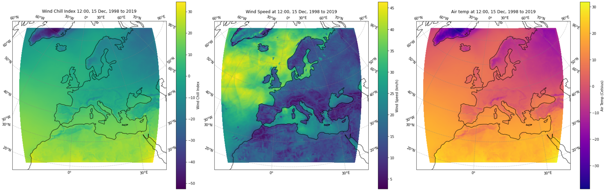

# C3S climate indices tutorials

## Introduction to climate indices

Climate indices are metrics used to quantify various aspects of the climate system, providing insights into trends, patterns, and anomalies. They are simplified (not to be confused with simple), numerical representations of complex climate patterns, or phenomena. Calculated from climate data, climate indices help us to track the behaviour of large-scale characteristics or features of the Earth’s climate system. This set of tutorials offer an introduction to climate indices, giving you insights into their definition, calculation methods, and interpretation.

### 1. Windchill index calculation

This tutorial demonstrates how to combine multiple variables of climate data to create an index. Through the workflow, you will calculate the windchill index, a climate index that estimates how cold it feels to the fuman body when wind is factored in with the actual air temperature. The skills and principles you use here can be applied to many other types of single or multi-variable indices.

The data is provided by Copernicus Climate Change Service (C3S) and includes regional climate reanalysis data (UERRA) of wind speed and temperature over Europe from 1961 to 2019.

The tutorial will first bring you through downloading the necessary data from the C3S Climate Data Store (CDS). You will then apply a commonly used Wind Chill Index formula to the data, and use the result to plot a map of the wind chill climatology for a particular day over Europe.

The steps shown in this tutorial can be applied to other climate datasets, such as the 5th version of the ECMWF Reanalysis (ERA5), or other data.

### 2. Working with the GTSMip dataset of global tides and surges

The GTSMip dataset provides high-resolution time series of sea level components, including tide elevation, storm surge residuals, total water level estimates and mean sea level. These component estimates are produced using the Global Tide and Surge Model (GTSMv3.0), developed by Deltares, and are available through the Copernicus Climate Change Service (C3S) Climate Data Store (CDS). 

Component estimates in GTSMip, in themselves, are not climate indices, however the dataset contains component estimates such as the GTSMip tide and surge water level timeseries, that can be used to derive indices or indicators to assess coastal flood risk, or quantify sea level trends. This notebook provides insights into an essential part of calculating Climate indices – exploring and understanding the input datasets. It provides a practical introduction on how to access, visualize and analyse [GTSMip tide and surge water level timeseries](https://cds.climate.copernicus.eu/datasets/sis-water-level-change-timeseries-cmip6?tab=overview) data available through C3S CDS.

### 3. End-to-end agroclimatic indicator generation

This notebook demonstrates the process of computing a \"Warm and wet days\" (WW) indicator (https://confluence.ecmwf.int/pages/viewpage.action?pageId=278550975), based on a climate projection.
